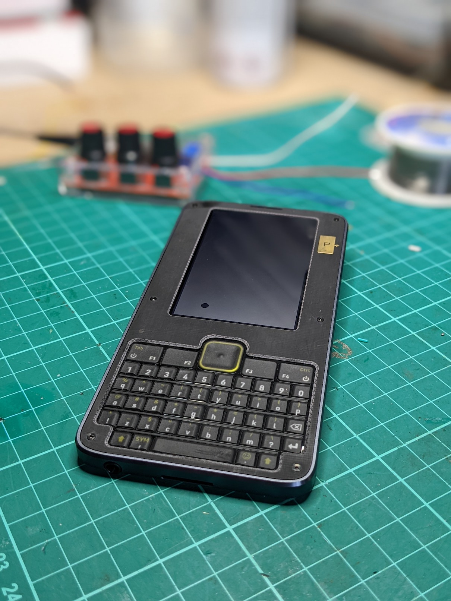
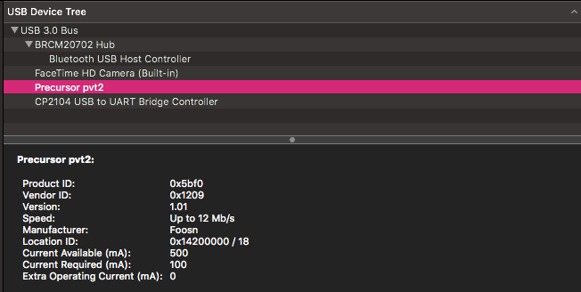
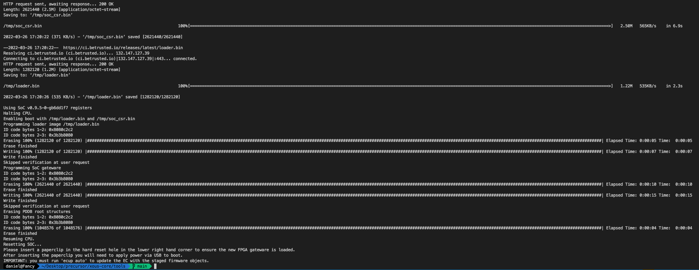
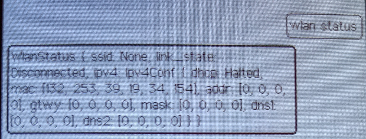
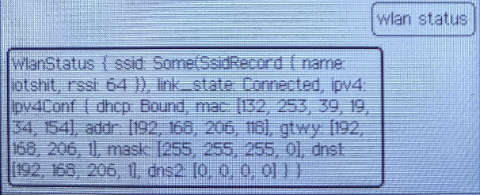

# Precursor



## What The?

When Bunnie announced Precursor back in 2020, I was smitten. The idea was bold. Create an
open hardware development platform for secure, mobile computation and communication. 

What was being proposed was a pocket-sized device that accommodates a built-in display, a physical keyboard, and an internal battery while remaining smaller and lighter than the average smartphone. 

Precursor was built for use on the road, but it compromises nothing as a development platform. Powered by an FPGA-hosted, soft-core System-on-Chip (SoC), it gives developers the freedom to inspect, verify, and customize nearly every aspect of its operation. 

We all wanted one. We were patient as hell due to global chip shortages but finally, mine arrived and this is the start of my journey learning how to interact with this device, how to develop Rust applications and explore how one does proper hardware/software security.

## Getting Started

First things first, if you've got one, you need to update it to the latest firmware. The wiki already has good [documentation](https://github.com/betrusted-io/betrusted-wiki/wiki/Updating-Your-Device) around how one goes about doing this, but tl:dr, this is how it works on macOS:

Step 1: Clone the repo https://github.com/betrusted-io/xous-core/
Inside there is the tools directory and the *factory_reset.sh* script
Step 2: Plug the device in using a decent cable. Under my mac, it appears as 



Step 3: You will need the following Python packages installed:

* 	1. ProgressBar2
* 	2. pyusb

Step 4: Run the update script like *./factory_reset.sh -s -l en* (this sets the release to be stable and my locale as en). 

If all goes to plan, it should look like this (this is on a mac, yours might be different)



Once rebooted, you *need* to [initialise](https://github.com/betrusted-io/betrusted-wiki/wiki/Initializing-Root-Keys) your root keys. 

Precursor has several security keys. Before you can start doing anything, however, you need to initialize a set of "root keys". This should be done only after you're satisfied that you are ready to trust your Precursor device. The threshold for that is up to you -- you can rebuild your own softcore-CPU and OS, and inspect every component on the motherboard; or you can just assume that out of the box everything is cool.

### Pretty Cool For a Wi-Fi Guy

If you want to set up Wi-Fi, there's a few steps you need to do first. If you've not set a pin code, I'd urge you to do that before you get into this. 

The first command you need to enter is

```
wifi status
```
It should return this



The wlan function has the following options:

* On/Off - Allows you to turn on/off the wireless card/
* setssid - Allows you to set the SSID
* setpass - Allows you to set the password
* join - Join a specific SSID
* leave - Leave a specific SSID
* status - Status of the wlan function
* save - Save the SSID/Password to the PDDB
* known - Displays saved network information

We can scan for available SSIDs using the ssid function

```
ssid scan
```

This will return a list access points (APs) with their corresponding Received Signal Strength Indicator (RSSI). Use this to set the SSID, like so:

```
wlan setssid iotshit
```

Then set the password

```
wlan setpassword chickenwaffles
```

Then you need to save this to the Plausibly Deniable DataBase (PDDB). I will be tearing into this at a later stage as it's friggin' amazing. 

```
wlan save
```

Now you can check the status using

```
wlan status
```




